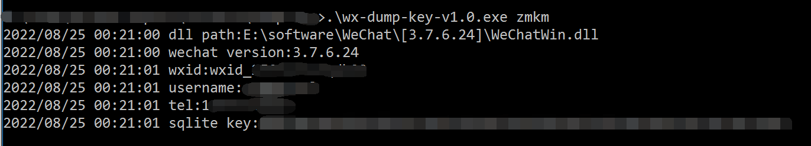
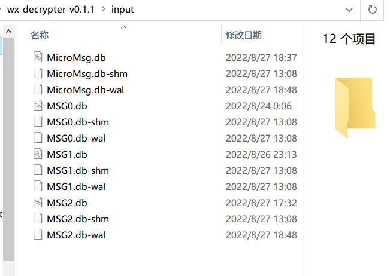
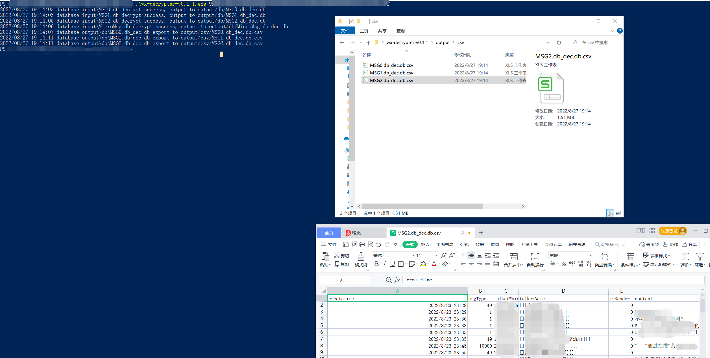

# wechat-export

## wx-dump-key

获取微信聊天记录数据库密钥，各版本通用。

程序中内置了两种方法获取微信聊天记录密钥，不需要考虑微信版本：
- 收集历史版本偏移，通过偏移获取密钥。
- 通过特征码定位的方式，搜索内存获取密钥。即使是未知版本也能获取到。

使用方法：`wx-dump-key-v0.1.0.exe zmkm`



## wx-decrypter
解密微信聊天记录，导出为db和csv格式。  

```
$ wx-decrypter.exe
Usage:
    1.put you db in "input" folder.
    2.run "wx-decrypter.exe your-sqlite-key"
```

使用方法：  
1、将需解密的数据库保存至程序所在目录的`input`目录中。  
`MSG<n>.db`中是消息记录（必需），`MicroMsg.db`中是好友列表（非必需）。



2、执行 `wx-decrypter.exe <获取到的密钥>`。  
解密后的文件位于`output`目录中。 



注：使用过程中程序**不会联网**。
